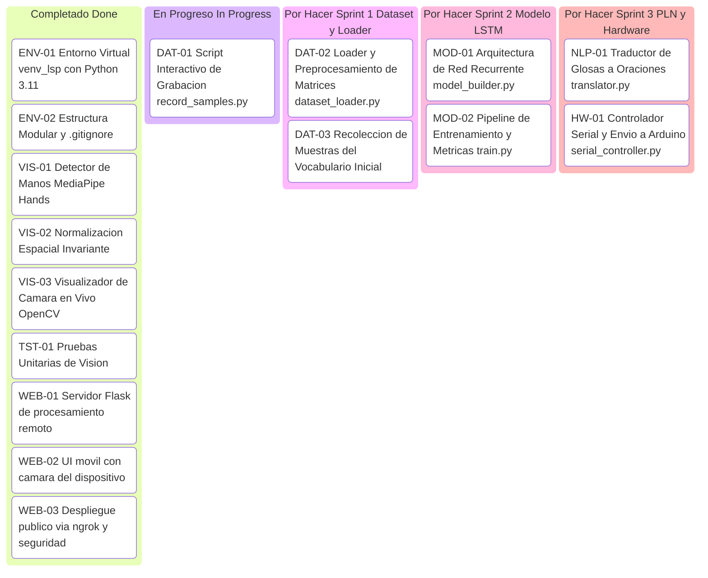

# 📋 Tablero de Trabajo KANBAN: Intérprete LSP con IA

Este documento sirve como la fuente única de seguimiento del progreso para los integrantes del equipo.
Actualizado: **22 de septiembre de 2026**.

---

## 📌 Resumen de Estado del Proyecto

| Estado | Tareas | Porcentaje |
|---|:---:|:---:|
| ✅ **Completado (Done)** | 9 | 56% |
| ⏳ **En Progreso (In Progress)** | 1 | 6% |
| 📋 **Por Hacer (To Do / Backlog)** | 6 | 38% |

---

## 🚀 Tablero de Tareas



---

## ✅ 1. Completado (Done)

- [x] **`[ENV-01]` Configuración de Runtime Python 3.11**
  - **Responsable:** Marlon Torres
  - **Resultado:** Python 3.11.9 instalado para compatibilidad con TensorFlow 2.16.1 y MediaPipe 0.10.14.

- [x] **`[ENV-02]` Estructura Modular y Repositorio Git**
  - **Responsable:** Marlon Torres
  - **Resultado:** Creación de carpetas `config`, `data`, `models`, `src`, `arduino`, `tests` y exclusión en `.gitignore` (incluyendo `.env`, `secrets.*` y `ngrok.yml`).

- [x] **`[VIS-01]` Detector de Manos MediaPipe (`src/vision/mediapipe_detector.py`)**
  - **Responsable:** Marlon Torres
  - **Resultado:** Clase `HandDetector` con extracción de vector plano determinista de 126 valores (63 izq + 63 der). Soporta detección de mano izquierda/derecha con confianza.

- [x] **`[VIS-02]` Normalización Espacial (`src/vision/normalization.py`)**
  - **Responsable:** Marlon Torres
  - **Resultado:** Centrado respecto a la muñeca e invarianza de escala respecto a la longitud de la palma.

- [x] **`[VIS-03]` Visualizador en Tiempo Real (`src/main.py`)**
  - **Responsable:** Marlon Torres
  - **Resultado:** Ventana interactiva con cámara en modo espejo, HUD con FPS y detección de mano Izquierda/Derecha. Salida con `q` / `ESC`.

- [x] **`[TST-01]` Suite de Pruebas Automatizadas (`tests/test_vision.py`)**
  - **Responsable:** Marlon Torres
  - **Resultado:** 4 tests unitarios pasando exitosamente sobre frames sintéticos.

- [x] **`[WEB-01]` Servidor Flask de procesamiento remoto (`web_server.py`)**
  - **Responsable:** Marlon Torres
  - **Fecha:** 22 sep 2026
  - **Resultado:** Servidor Flask con endpoint `POST /process_frame` que:
    - Recibe un frame JPEG en base64 desde cualquier dispositivo cliente
    - Lo procesa con `MediaPipe Hands` en la laptop (servidor)
    - Dibuja los 21 landmarks por mano sobre el frame
    - Devuelve el frame anotado en base64 + metadatos de manos + vector de 126 keypoints
    - **La cámara del laptop NO se usa ni se comparte en ningún momento**
    - Soporta múltiples clientes simultáneos con lock thread-safe

- [x] **`[WEB-02]` Interfaz móvil con cámara del dispositivo**
  - **Responsable:** Marlon Torres
  - **Fecha:** 22 sep 2026
  - **Resultado:** Página HTML/CSS/JS responsiva optimizada para celular que:
    - Activa la cámara del dispositivo con `getUserMedia` (sin instalar nada)
    - Captura y envía ~12 fps al servidor
    - Muestra: video procesado con landmarks · manos detectadas con confianza · FPS · latencia ida/vuelta · keypoints activos (de 126)
    - Botón para cambiar entre cámara frontal y trasera
    - Diseño dark glassmorphism con animaciones

- [x] **`[WEB-03]` Despliegue público vía ngrok y seguridad**
  - **Responsable:** Marlon Torres
  - **Fecha:** 22 sep 2026
  - **Resultado:**
    - Instalación y configuración de ngrok v3.39+ para túnel HTTPS público
    - Verificación de que ningún token/secreto está en el repositorio
    - `.gitignore` actualizado con exclusiones de `.env`, `secrets.*`, `ngrok.yml`
    - `.env.example` creado como plantilla para futuros colaboradores
    - Demo funcional: amigos conectan desde sus celulares y ven sus manos detectadas por MediaPipe en tiempo real

---

## ⏳ 2. En Progreso (In Progress)

### Rama: `feature/captura-mediapipe`
- [ ] **`[DAT-01]` Script interactivo de captura de muestras (`src/dataset/record_samples.py`)**
  - **Descripción:** Interfaz por consola y video para capturar secuencias de 30 cuadros por seña con cuenta regresiva.
  - **Criterio de Aceptación:**
    - Solicitar la acción a grabar (ej. `HOLA`).
    - Pausa/cuenta regresiva de 2 segundos para prepararse.
    - Guardar 30 cuadros de 126 valores como archivo `.npy` en `data/keypoints/<ACCION>/seq_<NUM>.npy`.
  - **Asignado a:** ____________________

---

## 📋 3. Por Hacer (To Do)

### Módulo Dataset (`feature/captura-mediapipe`)

- [ ] **`[DAT-02]` Dataset Loader y particionado (`src/dataset/dataset_loader.py`)**
  - **Descripción:** Función para recorrer recursivamente `data/keypoints/`, cargar las matrices `.npy`, generar etiquetas correspondientes y particionar en `X_train`, `X_test`, `y_train`, `y_test`.
  - **Criterio de Aceptación:** Retornar arrays con forma `(N_samples, 30, 126)` y etiquetas codificadas (One-Hot o Sparse).
  - **Asignado a:** ____________________

- [ ] **`[DAT-03]` Grabación de dataset del vocabulario inicial**
  - **Descripción:** Capturar al menos 30–50 secuencias por cada una de las 9 clases del vocabulario (`config/actions.py`).
  - **Criterio de Aceptación:** Archivo `.zip` compartido en Google Drive con la carpeta `data/keypoints/` completa.
  - **Asignado a:** ____________________

  > **💡 Idea:** Grabar usando `web_server.py` + celular facilita capturar muestras sin necesidad de estar frente a la laptop. Se puede adaptar el script de captura para recibir keypoints vía `/process_frame` y guardarlos directamente.

---

### Módulo Modelo LSTM (`feature/entrenamiento-lstm`)

- [ ] **`[MOD-01]` Definición de la arquitectura (`src/training/model_builder.py`)**
  - **Descripción:** Crear función `build_lstm_model(input_shape=(30, 126), num_classes=9)` usando TensorFlow/Keras.
  - **Criterio de Aceptación:** Modelo con capas LSTM (ej. 64, 128 unidades) con Dropout y salida Softmax compilado con categorical crossentropy.
  - **Asignado a:** ____________________

- [ ] **`[MOD-02]` Pipeline de entrenamiento y métricas (`src/training/train.py`)**
  - **Descripción:** Script ejecutable que cargue datos, entrene con EarlyStopping, guarde los pesos en `models/trained/lstm_lsp_model.h5` y genere gráfico de matriz de confusión.
  - **Criterio de Aceptación:** Exactitud > 85% en test set y reporte de F1-Score por clase guardado en log.
  - **Asignado a:** ____________________

---

### Módulo PLN Contextual (`feature/modulo-pln`)

- [ ] **`[NLP-01]` Traductor de glosas a español natural (`src/nlp/translator.py`)**
  - **Descripción:** Algoritmo de mapeo/reglas o modelo de secuencia para convertir secuencias de glosas LSP (ej. `["YO", "QUERER", "AGUA"]`) a una oración gramatical en español (`"Yo quiero agua"`).
  - **Criterio de Aceptación:** Pruebas unitarias que validen al menos 10 combinaciones sintácticas del vocabulario.
  - **Asignado a:** ____________________

---

### Módulo Hardware / Arduino (`feature/modulo-arduino`)

- [ ] **`[HW-01]` Controlador de comunicación serial (`src/hardware/serial_controller.py`)**
  - **Descripción:** Clase que gestione la conexión con el puerto COM usando `pyserial`, con envío no bloqueante de texto interpretado.
  - **Criterio de Aceptación:** Envío de string terminado en `\n` y manejo de reconexión si el cable se desconecta.
  - **Asignado a:** ____________________

- [ ] **`[HW-02]` Firmware de visualización en microcontrolador (`arduino/lsp_display_controller/`)**
  - **Descripción:** Programa en C++ para Arduino que lea por puerto serial y muestre la palabra o estado en una pantalla LCD 16x2 o matriz LED.
  - **Criterio de Aceptación:** Código compilable en Arduino IDE que reciba texto por Serial a 9600 baudios y lo imprima.
  - **Asignado a:** ____________________

---

## 🚧 4. Deuda Técnica y Mejoras Futuras

Estas tareas no bloquean el avance pero deben considerarse antes de una versión estable:

- [ ] **`[TECH-01]` Integrar inferencia LSTM en `web_server.py`**
  - Una vez entrenado el modelo, agregar un endpoint `/predict` que reciba la secuencia de 30 frames y devuelva la glosa LSP detectada con su nivel de confianza.

- [ ] **`[TECH-02]` Captura de dataset vía web**
  - Adaptar el servidor para guardar keypoints recibidos desde el celular en `data/keypoints/`, eliminando la dependencia de estar frente a la laptop durante la grabación.

- [ ] **`[TECH-03]` Reemplazar Flask dev server por Gunicorn + Waitress**
  - Para demostraciones más estables con varios usuarios simultáneos:
    ```powershell
    pip install waitress
    waitress-serve --port=5000 web_server:app
    ```

- [ ] **`[TECH-04]` Actualizar numpy cuando MediaPipe lo soporte**
  - `numpy 1.26.4` tiene CVEs moderados. Actualizar a `numpy>=2.0` cuando `mediapipe` libere soporte oficial.

---

## 🎯 Definición de Terminado (Definition of Done — DoD)

Para considerar una tarea como **Completada**:
1. El código cumple con las guías de estilo PEP 8 y tiene comentarios/docstrings claros.
2. Cuenta con prueba unitaria o verificación reproducible.
3. No se versionan archivos pesados (`.npy`, `.h5`, videos) ni secretos (`.env`, tokens).
4. El Pull Request cuenta con la aprobación de al menos un compañero de equipo antes de integrarse a `main`.
