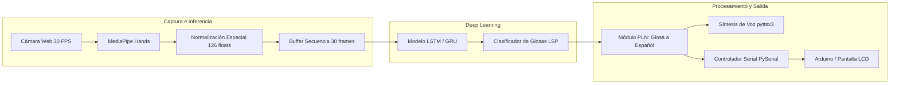

# 🇵🇪 Intérprete de Lengua de Señas Peruana (LSP) con IA

[](https://www.python.org/downloads/release/python-3119/)
[](https://tensorflow.org)
[](https://mediapipe.dev)
[](https://opencv.org)
[](KANBAN.md)

Sistema de traducción e interpretación bidireccional en tiempo real para la **Lengua de Señas Peruana (LSP)**. Combina visión por computadora con **MediaPipe**, redes neuronales recurrentes (**LSTM / GRU**), procesamiento de lenguaje natural (**PLN**) y retroalimentación física mediante **Arduino**.

---

## 📐 Arquitectura del Sistema



---

## 📂 Estructura Modular del Repositorio

```text
lsp-interpreter-ai/
├── .gitignore                      # Exclusión de entornos, modelos pesados y .npy
├── README.md                       # Documentación principal del proyecto
├── KANBAN.md                       # Tablero de tareas y seguimiento del equipo
├── CONTRIBUTING.md                 # Guía de contribución y ramas de Git
├── requirements.txt                # Dependencias fijadas del proyecto
│
├── config/                         # Parámetros globales y diccionarios
│   ├── __init__.py
│   ├── actions.py                  # Vocabulario de señas, glosas e identificadores
│   └── settings.py                 # FPS, umbrales de confianza, buffers y puertos
│
├── data/                           # Almacenamiento local (NO se sube a Git)
│   ├── raw_videos/                 # Videos originales de respaldo
│   └── keypoints/                  # Coordenadas numéricas procesadas (.npy)
│       ├── HOLA/
│       ├── GRACIAS/
│       └── REPOSO/
│
├── models/                         # Pesos de modelos exportados (NO en Git)
│   ├── trained/                    # lstm_lsp_model.h5, label_encoder.json
│   └── nlp/                        # Reglas o modelos de glosa a español
│
├── src/                            # Código fuente modular
│   ├── __init__.py
│   ├── main.py                     # Punto de entrada principal en tiempo real
│   ├── vision/                     # Visión por computadora
│   │   ├── mediapipe_detector.py   # Wrapper de detección de manos
│   │   └── normalization.py        # Centrado y escala de articulaciones
│   ├── dataset/                    # Manipulación y captura de secuencias
│   │   ├── record_samples.py       # Script interactivo de grabación
│   │   └── dataset_loader.py       # Carga de matrices .npy y train/test split
│   ├── training/                   # Arquitectura y entrenamiento
│   │   ├── model_builder.py        # Definición de la red (LSTM / GRU)
│   │   └── train.py                # Pipeline de entrenamiento y métricas
│   ├── nlp/                        # Interpretación contextual
│   │   └── translator.py           # Glosas LSP -> Español fluido
│   └── hardware/                   # Comunicación con microcontroladores
│       └── serial_controller.py    # Envío de estados a Arduino vía PySerial
│
├── arduino/                        # Firmware para microcontrolador
│   └── lsp_display_controller/
│       └── lsp_display_controller.ino
│
└── tests/                          # Pruebas automatizadas
    └── test_vision.py              # Tests del detector y normalización
```

---

## ⚡ Requisitos y Preparación del Entorno

> [!IMPORTANT]
> **Requisito crítico:** El proyecto requiere **Python 3.11** para garantizar compatibilidad con los binarios de `tensorflow==2.16.1` y `mediapipe==0.10.14`. No uses Python 3.14 directamente.

### Paso 1: Clonar el Repositorio
```bash
git clone https://github.com/TU_USUARIO/TU_REPOSITORIO.git
cd TU_REPOSITORIO
```

### Paso 2: Crear el Entorno Virtual (`venv_lsp`)

- **En Windows (PowerShell):**
  ```powershell
  py -3.11 -m venv venv_lsp
  .\venv_lsp\Scripts\Activate.ps1
  ```
- **En Linux / macOS:**
  ```bash
  python3.11 -m venv venv_lsp
  source venv_lsp/bin/activate
  ```

### Paso 3: Instalar Dependencias
```bash
pip install --upgrade pip
pip install -r requirements.txt
```

---

## 🚀 Ejecución Rápida

### 1. Probar la Detección de Manos en Vivo
Para abrir la ventana con tu cámara web y ver el esqueleto articular en tiempo real:
```powershell
.\venv_lsp\Scripts\python.exe src/main.py
```
*(Presiona `q` o `ESC` en la ventana para salir)*

### 2. Ejecutar Pruebas Automatizadas
```powershell
.\venv_lsp\Scripts\python.exe -m unittest discover tests/
```

---

## 📖 Vocabulario Inicial (LSP)

Definido en [`config/actions.py`](file:///D:/proyectos/interprete-lsp/config/actions.py):

| ID | Glosa LSP | Descripción |
|---|---|---|
| `0` | `REPOSO` | Manos abajo o sin realizar gesto |
| `1` | `HOLA` | Saludo con una mano |
| `2` | `GRACIAS` | Gesto de agradecimiento |
| `3` | `POR_FAVOR` | Petición cortés |
| `4` | `AYUDA` | Solicitud de asistencia |
| `5` | `YO` | Señalamiento pronominal |
| `6` | `QUERER` | Expresión de deseo |
| `7` | `AGUA` | Seña léxica para agua |
| `8` | `BUENOS_DIAS` | Saludo matutino compuesto |

---

## 👥 Colaboración y Ramas

Consulta [CONTRIBUTING.md](CONTRIBUTING.md) para el flujo de trabajo en Git y [KANBAN.md](KANBAN.md) para consultar las tareas asignadas a cada módulo.

