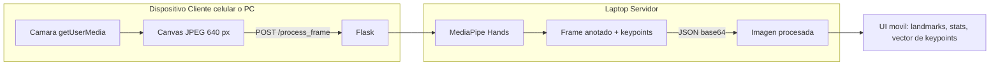

# Interprete de Lengua de Senas Peruana (LSP) con Inteligencia Artificial

[](https://www.python.org/downloads/release/python-3119/)
[](https://tensorflow.org)
[](https://mediapipe.dev)
[](https://opencv.org)
[](https://flask.palletsprojects.com)
[](KANBAN.md)

Prototipo académico para reconocer un vocabulario cerrado de **Lengua de Señas Peruana (LSP)** y producir texto en español. Actualmente implementa detección de manos y una demo web; captura de dataset, entrenamiento, traducción, lógica Prolog y control serial siguen pendientes. LSTM/GRU, PLN, voz y Arduino forman parte de la arquitectura objetivo.

## Planeación vigente — 6 de octubre de 2026

El [plan maestro](docs/PLAN-INTERPRETE-LSP.md) adapta las once fases de los [prompts maestros](<Prompts Maestros Integrales del Proyecto LSP.md>) al estado real del repositorio. Define alcance, decisiones, criterios VAL-01 a VAL-05, seguridad, contratos, UX, datos, entrenamiento, reglas, serial y pruebas. El [Kanban](KANBAN.md) distingue documentación, implementación y verificación; la [auditoría inicial](docs/quality/ISO-25010-AUDIT-REPORT.md) mantiene el gate de release pendiente.

El MVP es unidireccional LSP → glosas → español por plantillas revisadas. No existe todavía un intérprete completo ni traducción bidireccional. Los módulos dataset, training, nlp y el host serial son archivos de estructura con docstrings. No se puede grabar o entrenar ejecutándolos en su estado actual.

Desarrollado como producto formativo de la asignatura de Inteligencia Artificial, Escuela Profesional de Ingenieria de Sistemas, Universidad Privada San Juan Bautista, Lima, Peru, 2026.

---

## Arquitectura del Sistema

### Pipeline de inferencia completa (objetivo final)


```mermaid
flowchart LR
    subgraph Captura e Inferencia
        Cam[Camara Web 30 FPS] --> MP[MediaPipe Hands]
        MP --> Norm[Normalizacion Espacial 126 floats]
        Norm --> Buf[Buffer Secuencia 30 frames]
    end

    subgraph Deep Learning
        Buf --> LSTM[Modelo LSTM / GRU]
        LSTM --> Class[Clasificador de Glosas LSP]
    end

    subgraph Procesamiento y Salida
        Class --> NLP[Modulo PLN: Glosa a Espanol]
        NLP --> Audio[Sintesis de Voz pyttsx3]
        NLP --> Serial[Controlador Serial PySerial]
        Serial --> Ard[Arduino / Pantalla LCD]
    end
```

### Modo Demo Web (implementado -- web_server.py)

Permite demostrar la deteccion de manos a terceros sin que estos necesiten instalar nada. Cada dispositivo cliente usa su propia camara; la laptop actua unicamente como procesador de MediaPipe.


```mermaid
flowchart LR
    subgraph Dispositivo Cliente celular o PC
        Cam[Camara getUserMedia] --> JS[Canvas JPEG 640 px]
        JS -->|POST /process_frame| Srv
    end

    subgraph Laptop Servidor
        Srv[Flask] --> MP[MediaPipe Hands]
        MP --> Ann[Frame anotado + keypoints]
        Ann -->|JSON base64| Disp[Imagen procesada]
    end

    Disp --> UI[UI movil: landmarks, stats, vector de keypoints]
```

---

## Estructura del Repositorio

```text
interprete-lsp/
|-- .gitignore                      Exclusion de entornos, modelos pesados, .npy y secretos
|-- .env.example                    Plantilla de variables de entorno sin valores reales
|-- README.md                       Documentacion principal del proyecto
|-- KANBAN.md                       Tablero de tareas y seguimiento del equipo
|-- article.md                      Articulo tecnico formal del proyecto
|-- CONTRIBUTING.md                 Guia de contribucion y ramas de Git
|-- requirements.txt                Dependencias fijadas del proyecto
|-- web_server.py                   Servidor Flask para demo web via ngrok
|
|-- config/
|   |-- __init__.py
|   |-- actions.py                  Vocabulario de senas, glosas e identificadores
|   +-- settings.py                 FPS, umbrales de confianza, buffers y puertos
|
|-- data/                           Almacenamiento local (no se sube a Git)
|   |-- raw_videos/
|   +-- keypoints/
|       |-- HOLA/
|       |-- GRACIAS/
|       +-- REPOSO/
|
|-- models/                         Pesos de modelos exportados (no en Git)
|   |-- trained/                    lstm_lsp_model.h5, label_encoder.json
|   +-- nlp/
|
|-- src/
|   |-- __init__.py
|   |-- main.py                     Punto de entrada -- visualizador de escritorio OpenCV
|   |-- vision/
|   |   |-- mediapipe_detector.py   Clase HandDetector: extraccion de 126 keypoints
|   |   +-- normalization.py        Centrado e invarianza de escala
|   |-- dataset/
|   |   |-- record_samples.py       Script interactivo de grabacion
|   |   +-- dataset_loader.py       Carga de matrices .npy y train/test split
|   |-- training/
|   |   |-- model_builder.py        Definicion de la red LSTM / GRU
|   |   +-- train.py                Pipeline de entrenamiento y metricas
|   |-- nlp/
|   |   +-- translator.py           Glosas LSP a espanol fluido
|   +-- hardware/
|       +-- serial_controller.py    Envio de estados a Arduino via PySerial
|
|-- arduino/
|   +-- lsp_display_controller/
|       +-- lsp_display_controller.ino
|
+-- tests/
    +-- test_vision.py              Tests del detector y normalizacion
```

---

## Requisitos y Preparacion del Entorno

> [!IMPORTANT]
> El proyecto requiere **Python 3.11** para garantizar compatibilidad con los binarios de `tensorflow==2.16.1` y `mediapipe==0.10.14`. No usar Python 3.12 o superior directamente.

### Paso 1: Clonar el repositorio

```bash
git clone https://github.com/mrln-trrs/interprete-lsp.git
cd interprete-lsp
```

### Paso 2: Crear el entorno virtual

Windows (PowerShell):
```powershell
py -3.11 -m venv venv_lsp
.\venv_lsp\Scripts\Activate.ps1
```

Linux / macOS:
```bash
python3.11 -m venv venv_lsp
source venv_lsp/bin/activate
```

### Paso 3: Instalar dependencias

```bash
pip install --upgrade pip
pip install -r requirements.txt
```

---

## Ejecucion

### Demo web -- camara del dispositivo procesada por MediaPipe

Esta modalidad permite demostrar el sistema a terceros desde sus propios celulares sin necesidad de instalacion adicional.

```powershell
# Terminal 1: arrancar el servidor
.\venv_lsp\Scripts\python.exe web_server.py

# Terminal 2: exponer a internet con ngrok
ngrok http 5000
```

Compartir el link `https://xxxx.ngrok-free.app` generado. Cada usuario abre la URL en su dispositivo, activa su camara y observa sus propias manos detectadas en tiempo real por MediaPipe.
La exposición remota queda condicionada a los controles del [modelo STRIDE](docs/security/STRIDE-THREAT-MODEL.md): autorización, límites, errores seguros y aislamiento. El servidor actual es de desarrollo y no incorpora todos esos controles; estas instrucciones describen la demo histórica, sin acreditar seguridad de un despliegue público. Para revisión local puede usarse `python web_server.py --host 127.0.0.1`.

Configuracion de ngrok (solo la primera vez):
```powershell
ngrok config add-authtoken TU_TOKEN
```
Obtener el token en [dashboard.ngrok.com](https://dashboard.ngrok.com/get-started/your-authtoken).

**Comportamiento del servidor:**
- El dispositivo cliente captura video mediante `getUserMedia` a aproximadamente 12 fps.
- Cada frame se transmite como JPEG comprimido al endpoint `POST /process_frame`.
- La laptop ejecuta MediaPipe Hands, dibuja los 21 landmarks por mano y devuelve el frame anotado.
- La interfaz muestra: video procesado, manos detectadas con nivel de confianza, FPS, latencia de ida y vuelta, y el vector de 126 keypoints.
- **La camara del servidor no se usa ni se comparte en ningun momento.**

Parametros del servidor:

| Argumento | Default | Descripcion |
|---|---|---|
| `--port` | `5000` | Puerto HTTP |
| `--host` | `0.0.0.0` | Interfaz de red |

Endpoints:

| Ruta | Metodo | Descripcion |
|---|---|---|
| `/` | GET | Interfaz web principal, optimizada para movil |
| `/process_frame` | POST | Recibe JPEG, procesa con MediaPipe, devuelve frame anotado y keypoints |

### Modo escritorio -- visualizador local

```powershell
.\venv_lsp\Scripts\python.exe src/main.py
```

Presionar `q` o `ESC` para salir.

### Pruebas automatizadas

```powershell
.\venv_lsp\Scripts\python.exe -m unittest discover tests/
```

---

## Vocabulario Inicial (LSP)

Definido en [`config/actions.py`](config/actions.py):

| ID | Glosa LSP | Descripcion |
|---|---|---|
| 0 | REPOSO | Manos abajo o sin realizar gesto |
| 1 | HOLA | Saludo con una mano |
| 2 | GRACIAS | Gesto de agradecimiento |
| 3 | POR_FAVOR | Peticion cortes |
| 4 | AYUDA | Solicitud de asistencia |
| 5 | YO | Senalamiento pronominal |
| 6 | QUERER | Expresion de deseo |
| 7 | AGUA | Sena lexica para agua |
| 8 | BUENOS_DIAS | Saludo matutino compuesto |

---

## Variables de Entorno y Secretos

El proyecto no requiere un archivo `.env` para funcionar en su estado actual. Si se incorporan integraciones con servicios externos en el futuro:

1. Copiar `.env.example` como `.env`.
2. Completar los valores reales.
3. No hacer commit del `.env` -- esta incluido en `.gitignore`.

El token de ngrok se configura una vez mediante CLI y queda almacenado fuera del repositorio:
```powershell
ngrok config add-authtoken TU_TOKEN   # se guarda en AppData/Local/ngrok/ngrok.yml
```

---

## Colaboracion y Ramas

Consultar [CONTRIBUTING.md](CONTRIBUTING.md) para el flujo de trabajo en Git y [KANBAN.md](KANBAN.md) para las tareas asignadas a cada modulo.
Los nuevos cambios funcionales siguen el gate de revisión del plan; las pruebas de visión existentes no sustituyen aceptación del modelo, seguridad o accesibilidad.

Para el contexto academico y justificacion formal del proyecto consultar [article.md](article.md).
