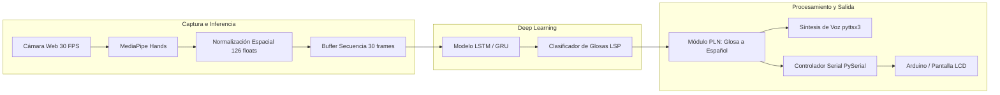
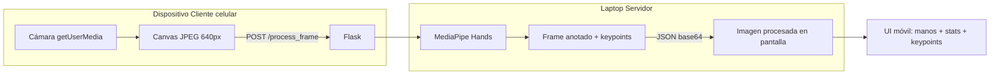

# 🇵🇪 Intérprete de Lengua de Señas Peruana (LSP) con IA

[](https://www.python.org/downloads/release/python-3119/)
[](https://tensorflow.org)
[](https://mediapipe.dev)
[](https://opencv.org)
[](https://flask.palletsprojects.com)
[](KANBAN.md)

Sistema de traducción e interpretación bidireccional en tiempo real para la **Lengua de Señas Peruana (LSP)**. Combina visión por computadora con **MediaPipe**, redes neuronales recurrentes (**LSTM / GRU**), procesamiento de lenguaje natural (**PLN**) y retroalimentación física mediante **Arduino**.

> **Demo en vivo:** El proyecto incluye un servidor web que permite a cualquier persona demostrar la detección de manos desde el celular, usando la laptop como procesador remoto de MediaPipe (sin compartir la cámara del servidor).

---

## 📐 Arquitectura del Sistema

### Modo de Inferencia Completa (objetivo final)


```mermaid
flowchart LR
    subgraph Captura e Inferencia
        Cam[Cámara Web 30 FPS] --> MP[MediaPipe Hands]
        MP --> Norm[Normalización Espacial 126 floats]
        Norm --> Buf[Buffer Secuencia 30 frames]
    end

    subgraph Deep Learning
        Buf --> LSTM[Modelo LSTM / GRU]
        LSTM --> Class[Clasificador de Glosas LSP]
    end

    subgraph Procesamiento y Salida
        Class --> NLP[Módulo PLN: Glosa a Español]
        NLP --> Audio[Síntesis de Voz pyttsx3]
        NLP --> Serial[Controlador Serial PySerial]
        Serial --> Ard[Arduino / Pantalla LCD]
    end
```

### Modo Demo Web (implementado — `web_server.py`)


```mermaid
flowchart LR
    subgraph Dispositivo Cliente celular
        Cam[Cámara getUserMedia] --> JS[Canvas JPEG 640px]
        JS -->|POST /process_frame| Srv
    end

    subgraph Laptop Servidor
        Srv[Flask] --> MP[MediaPipe Hands]
        MP --> Ann[Frame anotado + keypoints]
        Ann -->|JSON base64| JS2[Imagen procesada en pantalla]
    end

    JS2 --> UI[UI móvil: manos + stats + keypoints]
```

---

## 📂 Estructura Modular del Repositorio

```text
interprete-lsp/
├── .gitignore                      # Exclusión de entornos, modelos pesados, .npy y secretos
├── .env.example                    # Plantilla de variables de entorno (sin valores reales)
├── README.md                       # Documentación principal del proyecto
├── KANBAN.md                       # Tablero de tareas y seguimiento del equipo
├── CONTRIBUTING.md                 # Guía de contribución y ramas de Git
├── requirements.txt                # Dependencias fijadas del proyecto
├── web_server.py                   # 🌐 Servidor Flask para demo web vía ngrok
│
├── config/                         # Parámetros globales y diccionarios
│   ├── __init__.py
│   ├── actions.py                  # Vocabulario de señas, glosas e identificadores
│   └── settings.py                 # FPS, umbrales de confianza, buffers y puertos
│
├── data/                           # Almacenamiento local (NO se sube a Git)
│   ├── raw_videos/                 # Videos originales de respaldo
│   └── keypoints/                  # Coordenadas numéricas procesadas (.npy)
│       ├── HOLA/
│       ├── GRACIAS/
│       └── REPOSO/
│
├── models/                         # Pesos de modelos exportados (NO en Git)
│   ├── trained/                    # lstm_lsp_model.h5, label_encoder.json
│   └── nlp/                        # Reglas o modelos de glosa a español
│
├── src/                            # Código fuente modular
│   ├── __init__.py
│   ├── main.py                     # Punto de entrada — visualizador de escritorio (OpenCV)
│   ├── vision/                     # Visión por computadora
│   │   ├── mediapipe_detector.py   # Clase HandDetector: extracción de 126 keypoints
│   │   └── normalization.py        # Centrado e invarianza de escala
│   ├── dataset/                    # Manipulación y captura de secuencias
│   │   ├── record_samples.py       # Script interactivo de grabación
│   │   └── dataset_loader.py       # Carga de matrices .npy y train/test split
│   ├── training/                   # Arquitectura y entrenamiento
│   │   ├── model_builder.py        # Definición de la red (LSTM / GRU)
│   │   └── train.py                # Pipeline de entrenamiento y métricas
│   ├── nlp/                        # Interpretación contextual
│   │   └── translator.py           # Glosas LSP -> Español fluido
│   └── hardware/                   # Comunicación con microcontroladores
│       └── serial_controller.py    # Envío de estados a Arduino vía PySerial
│
├── arduino/                        # Firmware para microcontrolador
│   └── lsp_display_controller/
│       └── lsp_display_controller.ino
│
└── tests/                          # Pruebas automatizadas
    └── test_vision.py              # Tests del detector y normalización
```

---

## ⚡ Requisitos y Preparación del Entorno

> [!IMPORTANT]
> **Requisito crítico:** El proyecto requiere **Python 3.11** para garantizar compatibilidad con los binarios de `tensorflow==2.16.1` y `mediapipe==0.10.14`. No uses Python 3.12+ directamente.

### Paso 1: Clonar el Repositorio
```bash
git clone https://github.com/mrln-trrs/interprete-lsp.git
cd interprete-lsp
```

### Paso 2: Crear el Entorno Virtual (`venv_lsp`)

- **En Windows (PowerShell):**
  ```powershell
  py -3.11 -m venv venv_lsp
  .\venv_lsp\Scripts\Activate.ps1
  ```
- **En Linux / macOS:**
  ```bash
  python3.11 -m venv venv_lsp
  source venv_lsp/bin/activate
  ```

### Paso 3: Instalar Dependencias
```bash
pip install --upgrade pip
pip install -r requirements.txt
```

---

## 🚀 Ejecución Rápida

### 1. Demo Web — Cámara del celular procesada por MediaPipe

Esta es la forma más fácil de mostrar el proyecto a otras personas:

```powershell
# Terminal 1 — arrancar el servidor
.\venv_lsp\Scripts\python.exe web_server.py

# Terminal 2 — exponer a internet con ngrok
ngrok http 5000
```

Luego comparte el link `https://xxxx.ngrok-free.app` con tus amigos. Cada uno abre la URL en su celular, activa su cámara y ve sus propias manos detectadas en tiempo real por MediaPipe corriendo en tu laptop.

> **Nota ngrok:** La primera vez debes registrar tu authtoken gratuito:
> ```powershell
> ngrok config add-authtoken TU_TOKEN
> ```
> Obtén tu token en [dashboard.ngrok.com](https://dashboard.ngrok.com/get-started/your-authtoken).

**Cómo funciona el modo web:**
- El celular captura video con `getUserMedia` (~12 fps)
- Cada frame se envía como JPEG comprimido al endpoint `POST /process_frame`
- La laptop corre MediaPipe, dibuja los 21 landmarks por mano y devuelve el frame anotado
- La UI muestra: video procesado · manos detectadas · confianza · FPS · latencia · vector de 126 keypoints
- **La cámara del laptop NO se usa ni se comparte en ningún momento**

### 2. Modo Escritorio — Visualizador local (OpenCV)

```powershell
.\venv_lsp\Scripts\python.exe src/main.py
```
*(Presiona `q` o `ESC` en la ventana para salir)*

### 3. Pruebas Automatizadas

```powershell
.\venv_lsp\Scripts\python.exe -m unittest discover tests/
```

---

## 🌐 Parámetros del Servidor Web

| Argumento | Default | Descripción |
|---|---|---|
| `--port` | `5000` | Puerto HTTP |
| `--host` | `0.0.0.0` | Interfaz de red |

```powershell
# Ejemplo con puerto personalizado
.\venv_lsp\Scripts\python.exe web_server.py --port 8080
```

**Endpoints disponibles:**

| Ruta | Método | Descripción |
|---|---|---|
| `/` | `GET` | Interfaz web principal (optimizada para móvil) |
| `/process_frame` | `POST` | Recibe JPEG → procesa con MediaPipe → devuelve frame anotado + keypoints |

---

## 📖 Vocabulario Inicial (LSP)

Definido en [`config/actions.py`](config/actions.py):

| ID | Glosa LSP | Descripción |
|---|---|---|
| `0` | `REPOSO` | Manos abajo o sin realizar gesto |
| `1` | `HOLA` | Saludo con una mano |
| `2` | `GRACIAS` | Gesto de agradecimiento |
| `3` | `POR_FAVOR` | Petición cortés |
| `4` | `AYUDA` | Solicitud de asistencia |
| `5` | `YO` | Señalamiento pronominal |
| `6` | `QUERER` | Expresión de deseo |
| `7` | `AGUA` | Seña léxica para agua |
| `8` | `BUENOS_DIAS` | Saludo matutino compuesto |

---

## 🔐 Variables de Entorno y Secretos

Este proyecto **no requiere** archivo `.env` para funcionar. Sin embargo, si en el futuro se añaden integraciones con APIs externas:

1. Copia `.env.example` como `.env`
2. Rellena los valores reales
3. **Nunca hagas commit del `.env`** — está en `.gitignore`

El token de ngrok se configura una sola vez vía CLI y se guarda fuera del repositorio:
```powershell
ngrok config add-authtoken TU_TOKEN   # se guarda en AppData/Local/ngrok/ngrok.yml
```

---

## 👥 Colaboración y Ramas

Consulta [CONTRIBUTING.md](CONTRIBUTING.md) para el flujo de trabajo en Git y [KANBAN.md](KANBAN.md) para las tareas asignadas a cada módulo.
