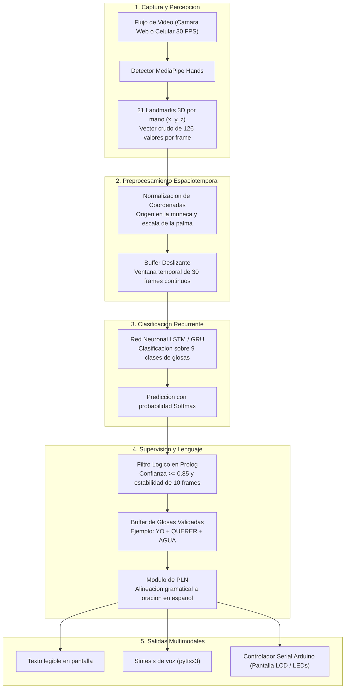
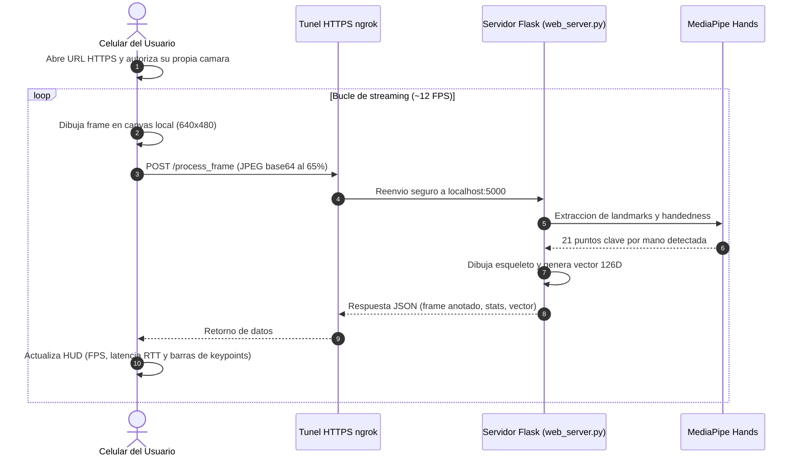
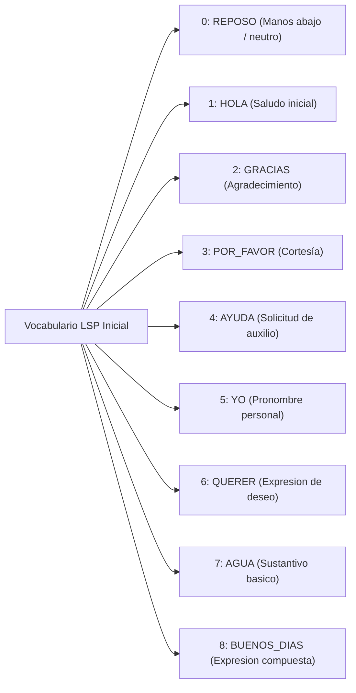

# Interprete de Lengua de Senas Peruana con IA: Diseno, Arquitectura y Proceso de Desarrollo

**Autor y Arquitectura de Software:** Marlon Omar Torres Espinoza  
**Repositorio del proyecto:** [https://github.com/mrln-trrs/interprete-lsp](https://github.com/mrln-trrs/interprete-lsp)  
**Marco del proyecto:** Iniciativa de codigo abierto gestada en la Universidad Privada San Juan Bautista (Escuela de Ingenieria de Sistemas, curso de Inteligencia Artificial, docente Mg. Luis Timir Ponce de Leon Arrivasplata), con el apoyo colaborativo en documentacion, alineacion tematica y recopilacion de ideas por parte de Smith Litano Loayza, Tracy Sandoval Evangelista y Piero Rojas Huaman.

---

## Area 1: Resumen y Contexto Rapido

### De que trata este proyecto?

Este proyecto consiste en el diseno y desarrollo de un interprete de Lengua de Senas Peruana (LSP) en tiempo real basado en Inteligencia Artificial y vision por computadora. A diferencia de las soluciones tradicionales que requieren guantes con sensores electronicos, camaras de profundidad costosas o programas pesados instalados localmente, esta propuesta esta concebida para funcionar con hardware accesible: una camara web convencional o incluso la camara de un telefono celular.

El sistema procesa el video continuo de las manos, extrae la cinematica articular mediante MediaPipe Hands (126 puntos tridimensionales por fotograma), analiza la secuencia temporal con redes neuronales recurrentes (LSTM/GRU), valida la certeza mediante reglas logicas en Prolog y finalmente traduce la expresion a una oracion coherente en espanol mediante procesamiento de lenguaje natural, emitiendola en texto, voz sintetizada y senalizacion con microcontroladores Arduino.

### El problema de fondo y el proposito altruista

En el Peru, las personas con discapacidad auditiva enfrentan a diario una gran brecha de comunicacion: la inmensa mayoria de la poblacion oyente desconoce por completo la Lengua de Senas Peruana. Una tarea cotidiana, como solicitar atencion medica, realizar un tramite administrativo o asistir a una clase, requiere casi siempre el acompanamiento de un interprete humano, cuya disponibilidad es limitada.

La meta principal de este desarrollo es eminentemente altruista y social: construir una maqueta tecnologica funcional, modular y de codigo abierto que demuestre que es posible derribar estas barreras sin crear una dependencia de equipos privativos caros. Al publicar todo el flujo de desarrollo, la arquitectura y el codigo fuente, se busca que la solucion sirva como punto de partida practico y reproducible para la comunidad de desarrolladores e investigadores interesados en tecnologia de asistencia.

---

## Area 2: Detalle del Proyecto, Estado y Elaboracion

### Como esta concebido el flujo de inferencia?

El sistema no intenta resolver todo el problema con un unico modelo monolítico de caja negra. En su lugar, utiliza una arquitectura por capas desacopladas, lo que permite mejorar, probar o sustituir cada etapa sin afectar al resto del pipeline.



### El proceso paso a paso

1. **Percepcion de manos:** Cada fotograma entrante es analizado por MediaPipe Hands, estimando las coordenadas de 21 articulaciones por extremidad (dedos y muneca). Al trabajar con dos manos simultaneas, cada cuadro se sintetiza en un vector numerico continuo de 126 posiciones.
2. **Normalizacion espacial:** Para que el algoritmo no dependa de cuan cerca o lejos se ubica la persona frente al lente, el vector se transforma: la muneca se define como coordenada `(0, 0, 0)` y todas las demas distancias se reescalan en funcion del tamano de la palma.
3. **Modelado temporal:** La lengua de senas no se compone de fotografias estaticas, sino de movimientos dinamicos en el tiempo. Se apilan 30 fotogramas consecutivos (aproximadamente un segundo de expresion) formando una matriz `(30, 126)` que entra a una red LSTM/GRU encargada de inferir que glosa se ejecuto.
4. **Control de falsos positivos:** Las redes neuronales pueden parpadear entre clases ante ruidos visuales. La capa logica en Prolog supervisa que la prediccion mantenga al menos un 85% de confianza durante 10 cuadros consecutivos antes de dar por buena una seña.
5. **Generacion de lenguaje natural:** La estructura de la LSP difiere del espanol (por ejemplo, el orden de sujeto, verbo y objeto suele variar). El modulo de PLN recibe las glosas confirmadas y construye oraciones gramaticalmente naturales, derivandolas a la sintesis de voz con `pyttsx3` y a una pantalla LCD externa con Arduino.

### El hito actual: Despliegue de la Maqueta Web

Para validar la deteccion en vivo sin obligar a los evaluadores o interesados a clonar el repositorio, instalar Python o configurar entornos virtuales, se implemento una maqueta de demostracion web remota.

#### El diseno de privacidad

Un principio estricto del diseno fue proteger la privacidad del servidor:
- La camara de la laptop que procesa el modelo **nunca se activa, no se usa y no se comparte**.
- El usuario remoto que abre el enlace en su telefono celular o computadora es quien proporciona el video a traves de su propia camara web, utilizando la API estandar `navigator.mediaDevices.getUserMedia`.
- La laptop anfitriona opera exclusivamente como nodo de computo matematico y de vision por computadora.



#### Rendimiento medido en pruebas reales

- **Frecuencia efectiva:** Entre 11 y 13 FPS estables sobre conexiones inalambricas convencionales.
- **Latencia de ida y vuelta (RTT):** Entre 85 y 115 milisegundos (conexion cliente -> ngrok -> Flask -> MediaPipe -> cliente).
- **Carga de red:** Fotogramas JPEG comprimidos con pesos de 32 a 42 KB, livianos para planes moviles.
- **Consumo computacional:** Entre 18% y 24% de procesador (CPU estandar), demostrando que no se requiere una tarjeta grafica de gama alta para ejecutar la percepcion articular.

### Buenas practicas de ingenieria y estructura del repositorio

El proyecto esta organizado bajo estrictos criterios de modularidad, trazabilidad y pruebas automatizadas:

```
interprete-lsp/
|-- web_server.py               Servidor Flask de la demo web remota
|-- README.md                   Documentacion de instalacion y puesta en marcha
|-- KANBAN.md                   Tablero de tareas del equipo
|-- CONTRIBUTING.md             Flujo de ramas Git y convenciones
|-- article.md                  Articulo divulgativo y tecnico para blog
|-- requirements.txt            Dependencias congeladas (Python 3.11)
|
|-- config/
|   +-- actions.py              Vocabulario de 9 clases LSP (REPOSO, HOLA, etc.)
|
|-- src/
|   |-- main.py                 Ejecutable de escritorio para pruebas locales
|   |-- vision/                 Extraccion de landmarks y normalizacion 126D
|   |-- data_collection/        Scripts para la captura sistematica de muestras
|   |-- training/               Construccion y entrenamiento de red LSTM
|   |-- nlp/                    Modulo de traduccion de glosas a espanol
|   +-- hardware/               Controlador serial de comunicacion con Arduino
|
|-- arduino/
|   +-- lsp_display_controller/ Firmware .ino para senalizacion externa
|
+-- tests/
    +-- test_vision.py          Suite automatizada de pruebas unitarias
```

#### Pruebas unitarias automatizadas

En `tests/test_vision.py` se validan los invariantes numericos del sistema:
- `test_detector_initialization`: Inicializacion correcta del motor MediaPipe.
- `test_normalization_dummy_hand`: Comprobacion de invariancia de escala y centrado en la muneca.
- `test_normalization_zeros`: Asegura que ante ausencia de manos el vector contenga ceros exactos.
- `test_process_blank_frame`: Comportamiento resiliente ante imagenes monocromaticas o sin contenido.

Las pruebas se ejecutan en 0.17 segundos de forma continua, asegurando que ningun cambio corrompa el pipeline matematico.

### Estado de avance del proyecto

| Modulo o Componente | Estado Actual | Observacion tecnica |
|---|---|---|
| Entorno y dependencias | Completado | Python 3.11, TensorFlow 2.16, MediaPipe 0.10.14 |
| Percepcion visual de manos | Completado | Extraccion y normalizacion de 126 valores validada |
| Suite de pruebas unitarias | Completado | Pruebas de vision ejecutandose con 100% de exito |
| Maqueta web interactiva | Completado | Despliegue con ngrok HTTPS y procesamiento remoto |
| Recoleccion de dataset | En desarrollo | Script para registrar 30 a 50 secuencias por seña |
| Modelo neuronal LSTM/GRU | Planificado | Arquitectura definida; a la espera del dataset consolidado |
| Logica simbolica en Prolog | Planificado | Reglas de aceptacion disenadas para conexion con Python |
| Traductor contextual PLN | Planificado | Mapeo de secuencias gramaticales hacia espanol |
| Hardware Arduino | Planificado | Firmware base preparado para integracion con PySerial |

---

## Area 3: Bases, Argumentacion y Detalles Teoricos, Tecnicos y Referencias como Fundamentacion

### Tabla de decisiones tecnologicas: Por que este stack?

Para comprender la arquitectura, es util contrastar las decisiones tomadas frente a las alternativas evaluadas:

| Componente | Opcion elegida | Alternativa descartada | Argumento de la eleccion |
|---|---|---|---|
| Entrada de percepcion | MediaPipe Hands (Keypoints 3D) | Pixeles crudos con CNN / YOLO | Reducir la imagen a 126 coordenadas elimina dependencias de iluminacion, tono de piel y fondo, haciendo el modelo miles de veces mas liviano. |
| Hardware de captura | Camara web / celular estandar | Guantes sensoriales con flexometros | Un guante con sensores cuesta cientos de dolares y es engorroso de colocar. Una camara ya esta integrada en cualquier dispositivo de uso diario. |
| Modelado temporal | Redes recurrentes LSTM / GRU | Clasificadores estaticos (SVM, Random Forest) | Los gestos continuos dependen del orden y la direccion del movimiento a traves del tiempo; una clasificacion estatica cuadro por cuadro no captura la intencion. |
| Filtro de estabilidad | Logica declarativa en Prolog | Umbral simple en codigo imperativo | Permite desacoplar las politicas de transicion de estados de la implementacion matematica, facilitando auditoria, explicabilidad y reglas formales. |
| Despliegue de demo | Flask + ngrok HTTPS | Despliegue en clusters de nube | Permite usar la potencia de computo del equipo personal como nodo local sin incurrir en costos de servidores en la nube durante fases de prototipado. |
| Salida fisica | Arduino + Pantalla LCD / LEDs | Uso exclusivo de monitor | Provee un canal de retroalimentacion tangible y portable que simula como funcionaria un dispositivo de asistencia autonomo en un mostrador o escritorio. |

### Parametros tecnicos formalizados

A partir de los requerimientos de tiempo real y capacidad de discriminacion gestual, se establecieron los siguientes parametros de diseno:

| Parametro | Valor | Justificacion tecnica |
|---|---|---|
| Tasa de muestreo objetivo | 30 FPS | Suficiente para registrar el movimiento de las manos sin perdida de informacion cinetica. |
| Numero de landmarks | 21 puntos por mano | Cubre las falanges distales, intermedias, proximales, metacarpianas y muneca. |
| Dimension del vector por frame | 126 valores float | `21 puntos * 3 coordenadas (x, y, z) * 2 manos`. |
| Ventana temporal de analisis | 30 fotogramas | Representa aproximadamente 1 segundo de duracion media de una seña individual en LSP. |
| Umbral de confianza neuronal | 0.85 (85%) | Criterio de corte para evitar que predicciones dudosas pasen a la cadena de lenguaje. |
| Estabilidad temporal minima | 10 fotogramas | Exige que la glosa predicha se mantenga constante durante al menos un tercio de segundo. |

### La supervision logica con Prolog

El rol de Prolog no es procesar imagenes, sino razonar sobre las deducciones generadas por la red neuronal. A continuacion se ilustra la formulacion de las reglas:

```prolog
% Hechos dinamicos transmitidos desde el script de Python
prediccion(yo, 0.96, 12).
prediccion(querer, 0.93, 11).
prediccion(agua, 0.91, 13).

% Constantes del sistema
umbral_confianza(0.85).
min_estabilidad(10).

% Regla: Una glosa es valida si supera ambos criterios
glosa_valida(Glosa) :-
    prediccion(Glosa, Confianza, Frames),
    umbral_confianza(U),
    min_estabilidad(E),
    Confianza >= U,
    Frames >= E.

% Evaluacion recursiva de la secuencia de senas
todas_validas([]).
todas_validas([Glosa|Resto]) :-
    glosa_valida(Glosa),
    todas_validas(Resto).

% Diccionario sintactico: Glosas LSP a oracion formal en espanol
oracion([yo, querer, agua], 'Yo quiero agua.').
oracion([hola, buenos_dias], 'Hola, muy buenos dias.').
oracion([ayuda, por_favor], 'Por favor, necesito ayuda.').

% Regla de inferencia general
evaluar(Secuencia, Oracion) :-
    todas_validas(Secuencia),
    oracion(Secuencia, Oracion).
```

Al consultar:
```prolog
?- evaluar([yo, querer, agua], Oracion).
Oracion = 'Yo quiero agua.'.
```
Si alguna de las senas de la secuencia tuvo baja confianza o duracion insuficiente, la unificacion falla y el sistema solicita de forma preventiva la repeticion del gesto antes de emitir una oracion erronea.

### Vocabulario inicial del repositorio

Definido en `config/actions.py`, comprende 9 clases fundamentales para evaluar el comportamiento del pipeline:



### Fundamentacion teorica y antecedentes

Este diseno se respalda en la literatura cientifica especializada en reconocimiento de lengua de senas:

- **Briones Cerquin y Tumay Guevara (2025):** Demostraron en su investigacion para la Universidad Tecnologica del Peru (y su publicacion en el *International Journal of Interactive Mobile Technologies*) que un pipeline de camara web + MediaPipe + LSTM alcanza precisiones de hasta 99.40% para secuencias dinamicas de 14 señas de la LSP, validando la solidez de esta combinacion tecnologica.
- **Camgoz et al. (2020):** Sustentan la necesidad de separar la etapa de reconocimiento de glosas de la etapa de traduccion al idioma natural, demostrando que los modelos secuenciales y de atencion aprenden mejor cuando las representaciones visuales no intentan mapearse directamente a texto sin una capa intermedia.
- **Damdoo, Kumar y Gogoi (2026):** Abordan la traduccion continua a nivel de oraciones completas, corroborando que tratar las señas como una secuencia estructurada y no como gestos aislados es la clave para una comunicacion interactiva real.
- **Ananthanarayana et al. (2021):** Evaluaron diferentes tecnicas de Deep Learning para traduccion de senas, concluyendo que la extraccion articular normalizada minimiza el sobreajuste frente a variaciones en la contextura de las personas y el fondo visual.
- **Russell y Norvig (2021):** Proporcionan el marco de agentes inteligentes racionales que combina percepcion sensorial, razonamiento simbolico y actuadores multimodales.
- **Lugaresi et al. (2019) y Zhang et al. (2020):** Documentan la arquitectura de MediaPipe Hands y la regresion topologica en tiempo real de 21 landmarks tridimensionales sobre CPU de consumo.

---

## Referencias Bibliograficas

- Ananthanarayana, T., Srivastava, P., Chintha, A., Santha, A., Landy, B., Panaro, J., Webster, A., Kotecha, N., Sah, S., Sarchet, T., Ptucha, R., & Nwogu, I. (2021). Deep learning methods for sign language translation. *ACM Transactions on Accessible Computing*, *14*(4), Article 22, 1-30. https://doi.org/10.1145/3477498
- Briones Cerquin, A. D., & Tumay Guevara, J. A. (2025). *Reconocimiento y clasificacion continua de imagenes de la Lengua de Senas Peruana empleando Deep Learning* [Tesis de pregrado, Universidad Tecnologica del Peru]. Repositorio Institucional UTP. https://hdl.handle.net/20.500.12867/12362
- Briones Cerquin, A. D., Tumay Guevara, J. A., & Ovalle, C. (2025). Mobile application for continuous recognition and classification of sign language images through deep learning. *International Journal of Interactive Mobile Technologies (iJIM)*, *19*(7), 4-21. https://doi.org/10.3991/ijim.v19i07.52853
- Camgoz, N. C., Koller, O., Hadfield, S., & Bowden, R. (2020). Sign language transformers: Joint end-to-end sign language recognition and translation. En *Proceedings of the IEEE/CVF Conference on Computer Vision and Pattern Recognition* (pp. 10023-10033). https://doi.org/10.1109/CVPR42600.2020.01004
- Clocksin, W. F., & Mellish, C. S. (2003). *Programming in Prolog: Using the ISO standard* (5.a ed.). Springer. https://doi.org/10.1007/978-3-642-55481-0
- Damdoo, R., Kumar, P., & Gogoi, R. (2026). End-to-end sentence-level Indian sign language translation with ISH-NEWS dataset and transformer model. *Scientific Reports*. https://doi.org/10.1038/s41598-026-60893-0
- Lugaresi, C., Tang, J., Nash, H., McClanahan, C., Uboweja, E., Hays, M., Zhang, F., Chang, C.-L., Yong, M. G., Lee, J., Chang, W.-T., Hua, W., Georg, M., & Grundmann, M. (2019). *MediaPipe: A framework for building perception pipelines* [Preprint]. arXiv. https://doi.org/10.48550/arXiv.1906.08172
- mrln-trrs. (2026). *interprete-lsp: Interprete de Lengua de Senas Peruana con Inteligencia Artificial* [Codigo fuente]. GitHub. https://github.com/mrln-trrs/interprete-lsp
- Russell, S. J., & Norvig, P. (2021). *Artificial intelligence: A modern approach* (4.a ed.). Pearson.
- Zhang, F., Bazarevsky, V., Vakunov, A., Tkachenka, A., Sung, G., Chang, C.-L., & Grundmann, M. (2020). *MediaPipe Hands: On-device real-time hand tracking* [Preprint]. arXiv. https://doi.org/10.48550/arXiv.2006.10214
