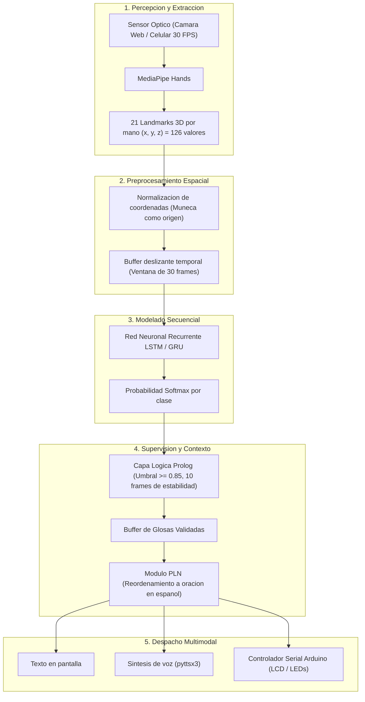
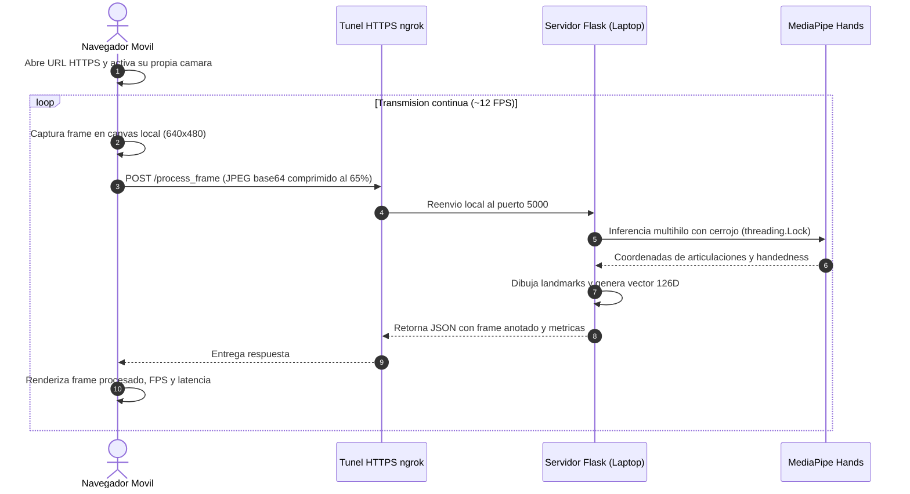

# Interprete de Lengua de Senas Peruana con IA

> **Stack:** Python 3.11 · MediaPipe · TensorFlow / Keras · Flask · Prolog · Arduino  
> **Estado:** Prototipo funcional (percepcion, pruebas unitarias y maqueta web remota completadas)  
> **Tipo:** Computer Vision · Deep Learning · NLP · Software Architecture  
>
> Desarrolle un sistema de interpretacion en tiempo real para la Lengua de Senas Peruana (LSP) capaz de operar sobre hardware convencional sin requerir sensores fisicos ni guantes especiales. El sistema extrae 126 coordenadas articulares tridimensionales mediante MediaPipe Hands, procesa la dinamica temporal a traves de una red recurrente (LSTM/GRU), filtra la estabilidad con reglas logicas en Prolog y traduce las secuencias a oraciones coherentes en espanol. Actualmente el proyecto cuenta con el pipeline de vision validado bajo pruebas unitarias automatizadas y una maqueta web funcional que permite a cualquier usuario transmitir video desde la camara de su propio celular hacia el servidor local via tunel seguro ngrok, manteniendo protegida la camara del anfitrion.

---

## 01 — Contexto

En el Peru, las personas con discapacidad auditiva enfrentan a diario una brecha de comunicacion constante: la inmensa mayoria de la poblacion oyente no conoce la Lengua de Senas Peruana. Esto convierte gestiones cotidianas, como acudir a un centro de salud, realizar tramites bancarios o estudiar, en situaciones que dependen casi exclusivamente de la disponibilidad de un interprete humano colegiado.

El proyecto nacio en las aulas de la Universidad Privada San Juan Bautista (VIII ciclo de Ingenieria de Sistemas, asignatura de Inteligencia Artificial guiada por el Mg. Luis Timir Ponce de Leon Arrivasplata), con apoyo colaborativo de Smith Litano, Tracy Sandoval y Piero Rojas en tareas de documentacion, alineacion academica e ideas iniciales. Mi meta al asumir la arquitectura y el desarrollo tecnico fue construir una maqueta funcional de codigo abierto orientada a un proposito estrictamente altruista: demostrar que es viable crear tecnologia asistiva accesible sin obligar al usuario a adquirir equipamiento privativo ni sensores de alto costo.

### Objetivo

Desarrollar un sistema capaz de capturar secuencias continuas de Lengua de Senas Peruana desde una camara comun, clasificar los gestos mediante tecnicas de aprendizaje profundo y reestructurar contextualmente los terminos en oraciones fluidas en espanol emitidas en texto, voz y senales fisicas.

### Alcance

- **Incluye:**
  - Percepcion visual de ambas manos en tiempo real mediante puntos clave articulares.
  - Normalizacion espacial invariante a la distancia y posicion frente a la lente.
  - Clasificacion continua sobre un vocabulario inicial de 9 clases representativas (`REPOSO`, `HOLA`, `GRACIAS`, `POR_FAVOR`, `AYUDA`, `YO`, `QUERER`, `AGUA`, `BUENOS_DIAS`).
  - Capa de supervision logica para filtrado de estabilidad y descarte de ruido.
  - Maqueta de demostracion web para dispositivos moviles conectada a un servidor de inferencia.
  - Integracion prevista hacia sintesis de voz local y microcontroladores Arduino.
- **Queda fuera:**
  - Reconocimiento de expresiones faciales o postura corporal completa (enfocado estrictamente en manos para optimizar recursos computacionales).
  - Traduccion simultanea de corpus extensos o conversaciones abiertas de alta complejidad gramatical (fase de prototipo con lexico controlado).
  - Procesamiento en el dispositivo movil del cliente (el cliente actua como sensor de captura; la computacion pesada ocurre en el servidor).

---

## 02 — Arquitectura

### Sistema

La arquitectura esta disenada como una canalizacion modular por capas desacopladas. En lugar de alimentar una red neuronal con imagenes crudas en un esquema monolítico, el sistema divide el problema en percepcion geometrica, analisis temporal, supervision formal y adaptacion linguistica.



### Componentes

- **Modulo de Percepcion (`src/vision/detector.py`):** Encapsula el detector MediaPipe Hands para localizar manos en el cuadro de video y obtener las coordenadas relativas de 21 articulaciones por extremidad.
- **Modulo de Normalizacion (`src/vision/normalizer.py`):** Transforma la geometria cruda en coordenadas invariantes a escala y traslacion espacial.
- **Buffer Temporal:** Memoria de tipo cola circular que acumula las ultimas 30 muestras temporales, equivalentes a aproximadamente un segundo de movimiento continuo.
- **Clasificador Recurrente (`src/training/model_builder.py`):** Red profunda con capas LSTM/GRU que aprende patrones de trayectoria y transicion entre articulaciones.
- **Supervisión Logica en Prolog:** Modulo basado en conocimiento que aplica reglas deterministas sobre la confianza y duracion del gesto, impidiendo que parpadeos visuales activen predicciones espurias.
- **Traductor Contextual (`src/nlp/translator.py`):** Componente de procesamiento de lenguaje natural encargado de mapear la cadena de glosas hacia la sintaxis del espanol hablado.
- **Servidor Web de Demostracion (`web_server.py`):** Aplicacion Flask que procesa fotogramas enviados por clientes remotos mediante endpoints REST.
- **Controlador Fisico (`src/hardware/serial_controller.py` y `arduino/`):** Canal de comunicacion serial PySerial para actualizar una pantalla LCD y diodos LED indicadores.

### Flujo

El recorrido de la informacion opera de la siguiente manera:

1. El sensor optico entrega fotogramas a una tasa de muestreo de hasta 30 FPS.
2. MediaPipe procesa el cuadro y produce 21 puntos clave por mano. Si se detectan dos extremidades, se emiten 126 valores flotantes; si solo hay una mano o ninguna, el vector se rellena congruentemente con ceros preservando las dimensiones fijas.
3. El vector se normaliza desplazando la muneca al origen `(0, 0, 0)` y dividiendo las distancias relativas por la escala de la palma.
4. El vector normalizado entra al buffer temporal. Una vez alcanzados los 30 cuadros, la matriz de dimension `(30, 126)` se evalua en el modelo recurrente.
5. El modelo devuelve una distribucion de probabilidades. Prolog consulta si la clase ganadora supera el umbral de 0.85 y si ha mantenido consistencia a lo largo de 10 cuadros consecutivos.
6. Si la seña se valida y se detecta una pausa posterior, el buffer de glosas acumuladas se despacha al traductor PLN.
7. La oracion generada (por ejemplo, `"Yo quiero agua."` a partir de `YO + QUERER + AGUA`) se reproduce de forma simultanea en la pantalla del usuario, en audio sintetizado y a traves del display fisico de Arduino.

---

## 03 — Implementación

Convertir esta arquitectura en codigo funcional implico abordar desafios practicos de sincronizacion, transmision de video y estabilidad matematica.

### Percepción

La percepcion articular se resolvio mediante `HandDetector`, implementado en OpenCV y MediaPipe. La primera alternativa considerada fue entrenar una red convolucional directamente sobre los pixeles del video; sin embargo, ese enfoque arrastraba dependencias criticas de iluminacion, tono de piel del senante y ruido de fondo.

Al aislar las articulaciones en 21 landmarks tridimensionales, el problema visual se transforma en un problema geometrico liviano. El normalizador toma estos puntos y asegura que una persona ubicada a dos metros de la camara genere el mismo vector caracteristico que una persona a cincuenta centimetros:

```python
# Centrado en el origen de la muneca
wrist = landmarks[0]
centered = landmarks - wrist

# Escalamiento por la longitud de la palma (distancia muneca a base dedo medio)
palm_size = np.linalg.norm(landmarks[9] - landmarks[0])
normalized = centered / (palm_size + 1e-6)
```

### Procesamiento

El flujo temporal requiere conservar la historia cinetica del gesto. En lugar de procesar cuadros aislados, agrupamos secuencias continuas en ventanas deslizantes de tamano 30.

Para la etapa logica, Prolog evalua predicciones mediante una base de reglas declarativas. En lugar de llenar el codigo en Python con anidaciones complejas de condiciones `if-else`, la logica de aceptacion se define formalmente:

```prolog
glosa_valida(Glosa) :-
    prediccion(Glosa, Confianza, Frames),
    umbral_confianza(U),
    min_estabilidad(E),
    Confianza >= U,
    Frames >= E.
```

Esto permite auditar con absoluta claridad por que una expresion fue aceptada o rechazada.

### Comunicación

Para demostrar el sistema sin obligar a los evaluadores a instalar Python ni dependencias en sus maquinas, desarrolle una maqueta web basada en Flask (`web_server.py`) y un tunel HTTPS via ngrok.

Aqui surgio un requerimiento de privacidad fundamental: **la camara de mi laptop nunca debia usarse ni compartirse**. La solucion consistio en un esquema cliente-servidor estricto:



El navegador movil captura su propia camara via `navigator.mediaDevices.getUserMedia`, comprime el cuadro como JPEG al 65% y lo envia por POST. El servidor decodifica la imagen en memoria, ejecuta MediaPipe, dibuja los landmarks y devuelve el fotograma anotado junto con el vector de 126 keypoints.

### Decisiones

| Criterio | Opcion elegida | Alternativa evaluada | Justificacion tecnica |
|---|---|---|---|
| Entrada de percepcion | MediaPipe Hands (126 floats) | Pixeles crudos con CNN / YOLO | Reducir el frame a 126 coordenadas elimina dependencias de fondo, ropa e iluminacion, reduciendo drasticamente la memoria de computo. |
| Hardware de captura | Camara web o celular estandar | Guantes de datos con sensores de flexion | Un guante con sensores cuesta cientos de dolares y es incomodo de usar. Una camara ya existe en cualquier bolsillo. |
| Modelado temporal | Redes recurrentes LSTM / GRU | Clasificadores estaticos cuadro por cuadro | Las senas dependen del orden y direccion del movimiento en el tiempo; una clasificacion estatica pierde la dinamica continua. |
| Logica de control | Supervision simbolica en Prolog | Logica imperativa con condicionales | Desacopla las reglas de negocio de la red neuronal, permitiendo trazabilidad y garantias formales en la confirmacion de glosas. |
| Demostracion remota | Flask local + tunel ngrok HTTPS | Servidores en la nube (AWS / GCP) | Aprovecha la potencia del equipo de desarrollo sin incurrir en costos de infraestructura durante la fase de prototipado. |
| Feedback fisico | Arduino + Pantalla LCD / LEDs | Monitor convencional exclusivamente | Simula el comportamiento de un dispositivo de asistencia autonomo para mostradores de atencion ciudadana. |

### Resultados

En pruebas reales con telefonos inteligentes conectados a traves de redes inalambricas convencionales (4G y Wi-Fi), se obtuvieron las siguientes mediciones operativas:

- **Frecuencia de transmision web:** 11 a 13 FPS, proporcionando una percepcion visual continua.
- **Latencia de ida y vuelta (RTT):** 85 a 115 milisegundos entre la captura del celular, el envio a ngrok, la inferencia en Flask y el retorno al navegador.
- **Peso de transferencia:** 32 a 42 KB por fotograma, liviano para consumo de datos moviles.
- **Uso de procesador (CPU):** Entre 18% y 24% en CPU estandar, demostrando que no se requiere GPU dedicada para la percepcion articular.
- **Pruebas unitarias automatizadas (`tests/test_vision.py`):** 4 pruebas ejecutadas con exito en 0.17 segundos, validando integridad dimensional (126 floats), invarianza espacial y resiliencia ante imagenes vacias.

### Limitaciones

- **Saturacion de ancho de banda:** Si la conexion a internet del cliente experimenta fluctuaciones severas, la tasa de fotogramas decae por debajo de 8 FPS, afectando la suavidad visual.
- **Oclusion de articulaciones:** Si una mano cubre completamente a la otra en senas cruzadas, MediaPipe puede perder momentaneamente la posicion de los dedos ocluidos.
- **Dataset en desarrollo:** Aunque el pipeline de vision esta al 100%, el clasificador neuronal requiere culminar la etapa de grabacion controlada de secuencias para iniciar el entrenamiento formal.

---

## 04 — Fundamentos

### Representación gestual

MediaPipe Hands desacopla el problema en dos redes convolucionales: un detector de palmas que opera sobre el fotograma completo y un modelo de regresion que estima 21 puntos tridimensionales por mano. Trabajar con coordenadas articulares reduce los datos de entrada desde matrices de miles de pixeles (`640 * 480 * 3 = 921,600` valores) hacia un vector estructurado de solo 126 escalares:

$$\text{Vector por frame} = 21 \text{ landmarks} \times 3 \text{ dimensiones } (x, y, z) \times 2 \text{ manos} = 126 \text{ floats}$$

Esta reduccion de dimensionalidad es la que permite procesar el video en tiempo real incluso en computadores portatiles sin aceleradores graficos dedicados.

### Reconocimiento temporal

Las senas no son posturas estaticas; son trayectorias continuas en el espacio. Las redes neuronales recurrentes LSTM (Long Short-Term Memory) incorporan celdas de memoria y compuertas de olvido, entrada y salida que regulan el flujo de informacion a traves del tiempo:

$$f_t = \sigma(W_f \cdot [h_{t-1}, x_t] + b_f)$$
$$i_t = \sigma(W_i \cdot [h_{t-1}, x_t] + b_i)$$
$$C_t = f_t * C_{t-1} + i_t * \tilde{C}_t$$
$$h_t = o_t * \tanh(C_t)$$

Esto permite a la red retener patrones de movimientos ejecutados al inicio del fotograma 1 y relacionarlos con el desenlace del fotograma 30, capturando la intencion del gesto.

### Inferencia simbólica

La combinacion de tecnicas subsimbolicas (redes neuronales) con tecnicas simbolicas (logica de primer orden) conforma un sistema hibrido. Mientras la red neuronal calcula la distribucion probabilistica de que un gesto sea una determinada seña, Prolog gobierna el estado del agente:

```prolog
% Hechos que recibe el sistema desde Python
prediccion(yo, 0.96, 12).
prediccion(querer, 0.93, 11).
prediccion(agua, 0.91, 13).

% Constantes operativas
umbral_confianza(0.85).
min_estabilidad(10).

% Evaluacion recursiva de la secuencia
todas_validas([]).
todas_validas([Glosa|Resto]) :-
    prediccion(Glosa, Confianza, Frames),
    umbral_confianza(U),
    min_estabilidad(E),
    Confianza >= U,
    Frames >= E,
    todas_validas(Resto).

% Diccionario semantico
oracion([yo, querer, agua], 'Yo quiero agua.').

% Meta principal
evaluar(Secuencia, Oracion) :-
    todas_validas(Secuencia),
    oracion(Secuencia, Oracion).
```

Si el modelo detecta un gesto con 0.70 de certeza debido a iluminacion deficiente, la unificacion falla y el sistema evita generar texto incoherente.

### Procesamiento del lenguaje

La Lengua de Senas Peruana presenta una estructura sintactica diferente al espanol. Una persona sorda puede articular la secuencia de glosas `[YO, AGUA, QUERER]` o `[YO, QUERER, AGUA]`. La labor del componente de PLN es normalizar estas estructuras para construir oraciones formales con conjugaciones verbales correctas y articulos concordantes.

### Referencias

- **Ananthanarayana, T. et al. (2021).** Deep learning methods for sign language translation. *ACM Transactions on Accessible Computing*, 14(4), 1-30.
- **Briones Cerquin, A. D. y Tumay Guevara, J. A. (2025).** *Reconocimiento y clasificacion continua de imagenes de la Lengua de Senas Peruana empleando Deep Learning*. Tesis de pregrado, Universidad Tecnologica del Peru.
- **Camgoz, N. C. et al. (2020).** Sign language transformers: Joint end-to-end sign language recognition and translation. *IEEE/CVF CVPR*, 10023-10033.
- **Clocksin, W. F. y Mellish, C. S. (2003).** *Programming in Prolog: Using the ISO standard* (5ta ed.). Springer.
- **Damdoo, R., Kumar, P. y Gogoi, R. (2026).** End-to-end sentence-level Indian sign language translation with ISH-NEWS dataset and transformer model. *Scientific Reports*.
- **Lugaresi, C. et al. (2019).** MediaPipe: A framework for building perception pipelines. *arXiv preprint arXiv:1906.08172*.
- **Russell, S. J. y Norvig, P. (2021).** *Artificial Intelligence: A Modern Approach* (4ta ed.). Pearson.
- **Zhang, F. et al. (2020).** MediaPipe Hands: On-device real-time hand tracking. *arXiv preprint arXiv:2006.10214*.

---

## 05 — Estado

### Actual

- Modulo de percepcion visual y extraccion de 126 caracteristicas culminado al 100%.
- Normalizador espacial con invarianza de escala y centrado operativo.
- Suite de pruebas unitarias automatizadas (`tests/test_vision.py`) superada.
- Maqueta web remota desplegada mediante Flask + ngrok HTTPS con cliente movil funcional y preservacion estricta de la camara del servidor.
- Vocabulario inicial de 9 clases estructurado en `config/actions.py`.

### Siguiente

- Culminar el script de grabacion sistematica de muestras (`src/data_collection/record_samples.py`) para capturar entre 30 y 50 repeticiones por cada una de las 9 glosas.
- Entrenar y evaluar la red neuronal recurrente LSTM sobre el corpus generado.
- Exponer el endpoint de prediccion continua en el servidor web para que la interfaz movil no solo muestre los keypoints, sino la oracion traducida en tiempo real.
- Conectar la salida validada hacia el firmware de Arduino para despliegue en pantalla LCD fisica.

### Código

El proyecto completo, el codigo fuente, las pruebas y las instrucciones de reproduccion local estan disponibles en el repositorio publico:  
[https://github.com/mrln-trrs/interprete-lsp](https://github.com/mrln-trrs/interprete-lsp)
