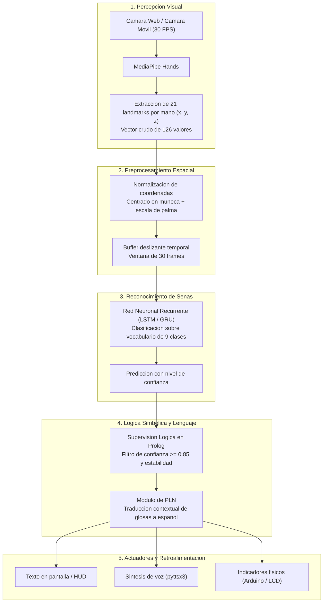
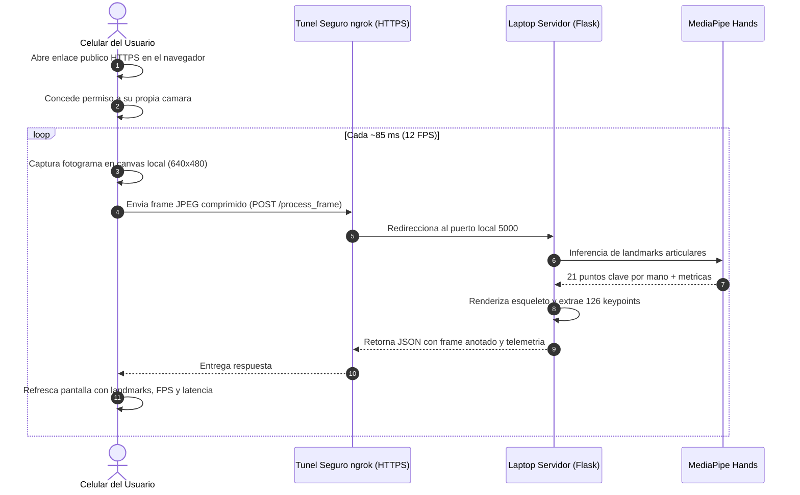

# Construyendo un Interprete de Lengua de Senas Peruana con Inteligencia Artificial: Un Proyecto Open Source para la Inclusion

**Autores:** Marlon Omar Torres Espinoza, Smith Yonathan Litano Loayza, Tracy Anai Sandoval Evangelista, Piero Jeanpierre Rojas Huaman  
**Institucion:** Universidad Privada San Juan Bautista -- Escuela Profesional de Ingenieria de Sistemas  
**Curso:** Inteligencia Artificial | **Docente responsable:** Mg. Luis Timir Ponce de Leon Arrivasplata  
**Repositorio de codigo abierto:** [https://github.com/mrln-trrs/interprete-lsp](https://github.com/mrln-trrs/interprete-lsp)  

---

## Resumen Ejecutivo

En el Peru, miles de personas con discapacidad auditiva enfrentan a diario una barrera invisible pero contundente: la enorme mayoria de la poblacion oyente desconoce por completo la Lengua de Senas Peruana (LSP). Esta desconexion limita la autonomia, el acceso a servicios esenciales y la integracion educativa o laboral de las personas sordas.

Este proyecto nace en las aulas universitarias como una iniciativa de codigo abierto y proposito altruista orientada a construir un puente tecnologico accesible. En lugar de exigir equipos costosos o guantes con sensores fisicos, desarrollamos un sistema de interpretacion en tiempo real capaz de operar sobre hardware convencional: una simple camara web o la camara de un telefono celular.

Mediante vision por computadora (MediaPipe Hands), extraccion y normalizacion de 126 puntos articulares en 3D, redes neuronales recurrentes (LSTM) y una capa de supervision logica en Prolog, el sistema transforma secuencias de senas en oraciones coherentes en espanol reproducidas en texto y voz. Actualmente, el proyecto cuenta con un nucleo de vision validado y una maqueta web funcional que permite a cualquier usuario probar la deteccion gestual en vivo desde su celular a traves de internet.

---

## 1. El Proposito: Tecnologia Altruista y Acceso Sin Barreras

### La Brecha Comunicativa en el Contexto Peruano

La lengua materna de la comunidad sorda en el pais es la Lengua de Senas Peruana, una lengua natural de modalidad visual-gestual provista de su propia fonologia, gramatica y sintaxis espacial. A diferencia de lo que comunmente se asume, la LSP no es una traduccion palabra por palabra del espanol; posee giros morfologicos y ordenes oracionales unicos.

En la vida practica, realizar un tramite bancario, acudir a una consulta medica o asistir a una clase universitaria suele requerir la presencia de un interprete humano colegiado. Dada la escasez de interpretes profesionales en el pais, las personas sordas ven condicionada su independencia cotidiana.

### Por que un Enfoque de Codigo Abierto y Bajo Costo?

Historicamente, muchos prototipos de reconocimiento de senas han recurrido a guantes de datos con sensores de flexion, acelerometros cableados o camaras de profundidad como Microsoft Kinect. Si bien estas aproximaciones ofrecen senales limpias, sufren de tres graves problemas:

1. **Inaccesibilidad economica:** Su costo es prohibitivo para familias e instituciones de recursos limitados.
2. **Incomodidad de uso:** Requieren colocarse dispositivos fisicos invasivos en las manos.
3. **Fragilidad y dependencia:** Dificultan su adaptacion en campo abierto o en dispositivos moviles cotidianos.

Nuestra filosofia de diseno parte de una premisa contraria: **democratizar el acceso**. La herramienta debe funcionar con lo que cualquier estudiante o ciudadano ya tiene en el bolsillo o en su escritorio: una camara RGB estandar y una conexion web. Al liberar el desarrollo como software libre bajo estandares abiertos en GitHub, buscamos que la solucion funcione como una maqueta de referencia viva, reproducible por otros investigadores y enriquecida por la propia comunidad sorda.

---

## 2. Arquitectura del Sistema: Como Funciona la Inferencia

El flujo de procesamiento se estructura en capas independientes para separar la percepcion visual del razonamiento linguistico y de las salidas multimedia.



### Componentes Clave

- **MediaPipe Hands:** Modelo de aprendizaje profundo de Google que detecta palmas y estima 21 puntos clave tridimensionales por mano. Procesa ambas manos, generando un vector estructurado de 126 caracteristicas continuas (`21 puntos * 3 coordenadas * 2 manos`).
- **Normalizador Espacial:** Convierte los puntos en invariantes respecto a la distancia a la camara y la posicion de la mano en el encuadre. Se fija la muneca como origen `(0, 0, 0)` y se reescala la distancia respecto a la longitud de la palma.
- **Ventana Temporal (30 frames):** Las senas son dinamicas; no basta con analizar una foto fija. El sistema acumula una ventana de 30 fotogramas continuos (aproximadamente un segundo de grabacion) para capturar la trayectoria del gesto.
- **Red LSTM / GRU:** Analiza la evolucion temporal de los 30 vectores para inferir la glosa correspondiente dentro del vocabulario inicial definido en `config/actions.py` (`REPOSO`, `HOLA`, `GRACIAS`, `POR_FAVOR`, `AYUDA`, `YO`, `QUERER`, `AGUA`, `BUENOS_DIAS`).
- **Supervision Logica en Prolog:** Evita clasificaciones erroneas o parpadeos. Si la confianza no supera el 85% de certeza de manera sostenida durante al menos 10 fotogramas, la seña no se confirma.
- **Procesamiento de Lenguaje Natural (PLN):** Convierte secuencias sintacticas de la lengua de senas (como `[YO, QUERER, AGUA]`) en expresiones fluidas en espanol formal (`"Yo quiero agua."`), las cuales se reproducen en audio sintetizado y se proyectan en pantalla.

---

## 3. El Estado Actual: La Maqueta de Despliegue Web

### El Reto de Compartir el Proyecto

Uno de los principales obstaculos durante el desarrollo fue resolver la siguiente pregunta: **Como podemos demostrar el funcionamiento del sistema a profesores, companeros o evaluadores sin obligarlos a clonar el repositorio, configurar entornos virtuales de Python ni instalar dependencias pesadas en sus computadoras?**

La respuesta fue construir una maqueta de despliegue web ligera y desacoplada mediante Flask y ngrok.

### Principio de Privacidad: La Camara del Servidor Queda Protegida

Un requisito indispensable en esta maqueta fue la seguridad y la privacidad:
- La camara de la laptop que actua como servidor **no se enciende, no se usa y no se comparte** bajo ninguna circunstancia.
- La laptop actua estrictamente como un motor de procesamiento matematico y de vision.
- Cada persona que ingresa al enlace utiliza **la camara de su propio celular o laptop**, capturada de forma local en su navegador web.



### Resultados Operativos de la Demo Web

Las pruebas realizadas conectando telefonos inteligentes de prueba a traves de redes 4G y Wi-Fi convencionales demostraron un comportamiento altamente satisfactorio:

- **Tasa de transmision:** 11 a 13 fotogramas por segundo, ideal para percepcion fluida en moviles.
- **Latencia de ida y vuelta (RTT):** Entre 85 y 115 milisegundos en condiciones reales de conexion.
- **Tamano de carga:** Fotogramas JPEG comprimidos al 65% con pesos de 32 a 42 KB, evitando el consumo excesivo de datos.
- **Carga de CPU:** El procesamiento de MediaPipe en la laptop opera entre 18% y 24% de uso de CPU, sin exigir tarjetas graficas dedicadas.

---

## 4. Como se Desarrolla el Proyecto: Ingenieria y Buenas Practicas

Al tratarse de una iniciativa universitaria de software libre pensada para escalar, la calidad de codigo y la reproducibilidad son fundamentales.

### Estructura Modular del Codigo

El repositorio mantiene una organizacion limpia donde cada modulo cumple una unica responsabilidad:

```
interprete-lsp/
|-- web_server.py               Servidor web Flask para la demo remota
|-- README.md                   Guia de instalacion y uso paso a paso
|-- KANBAN.md                   Tablero de seguimiento del equipo
|-- CONTRIBUTING.md             Normas de contribucion y ramas Git
|-- article.md                  Articulo divulgativo y academico del proyecto
|-- requirements.txt            Dependencias congeladas (Python 3.11)
|
|-- config/
|   +-- actions.py              Vocabulario oficial y mapeo de glosas
|
|-- src/
|   |-- main.py                 Lanzador de escritorio para pruebas locales
|   |-- vision/                 Extraccion de landmarks y normalizacion 126D
|   |-- data_collection/        Scripts para grabacion de dataset
|   |-- training/               Construccion y entrenamiento de red LSTM
|   |-- nlp/                    Modulo de traduccion contextual de oraciones
|   +-- hardware/               Controlador serial de comunicacion con Arduino
|
|-- arduino/
|   +-- lsp_display_controller/ Firmware para pantallas LCD e indicadores
|
+-- tests/
    +-- test_vision.py          Suite automatizada de pruebas unitarias
```

### Calidad Garantizada con Pruebas Automatizadas

Cada componente de vision cuenta con pruebas unitarias que se ejecutan antes de integrar cambios. La suite `tests/test_vision.py` valida:
1. **Integridad dimensional:** Confirmacion de que todo fotograma analizado entrega exactamente 126 valores numericos flotantes.
2. **Invarianza matematica:** Comprobacion de que la traslacion de la mano en el espacio no distorsione las caracteristicas relativas normalizadas.
3. **Tolerancia a fallos:** Respuesta correcta ante imagenes vacias o fondos sin presencia de manos humanas.

Todas las pruebas se ejecutan en aproximadamente 0.17 segundos con resultado exitoso.

### Seguridad y Proteccion de Secretos

Como buena practica de desarrollo en repositorios publicos:
- Se mantiene un archivo `.gitignore` estricto que previene la fuga involuntaria de credenciales, tokens de ngrok o archivos `.env`.
- Se suministra un `.env.example` documentado como guia para quienes deseen desplegar sus propias instancias.
- La configuracion del authtoken de ngrok se efectua exclusivamente a nivel de la estacion local, protegiendo las cuentas de los desarrolladores.

---

## 5. Estado de Avance y Proximos Pasos

El estado actual del proyecto se resume en la siguiente matriz de desarrollo:

| Componente | Estado | Que se ha completado |
|---|---|---|
| Entorno y Dependencias | Completado | Python 3.11, TensorFlow 2.16, MediaPipe 0.10.14 |
| Percepcion Visual (MediaPipe) | Completado | Detector de manos, normalizador espacial 126D y visualizador |
| Pruebas Unitarias de Vision | Completado | Suite de tests automatizados superada con exito |
| Maqueta Web con ngrok | Completado | Servidor Flask multihilo, UI movil y transmision remota segura |
| Recoleccion de Dataset | En progreso | Diseno del script para grabar secuencias de 30 frames por glosa |
| Modelo Neuronal LSTM | Pendiente | Entrenamiento sobre las 9 clases del vocabulario |
| Modulo de Reglas Prolog | Pendiente | Validacion formal de umbrales y estabilidad temporal |
| Motor de Lenguaje Natural | Pendiente | Ensamblado de glosas reconocidas a oraciones en espanol |
| Integracion con Arduino | Pendiente | Envio de oraciones hacia pantalla LCD y LEDs via PySerial |

---

## 6. Como Colaborar con la Iniciativa

Este proyecto es de codigo abierto y da la bienvenida a aportes de la comunidad tecnica y de la comunidad sorda:

1. **Contribucion en datos:** Ayudar a grabar secuencias gestuales para ampliar la diversidad de usuarios, iluminaciones y estilos de senas en el dataset.
2. **Optimizacion de modelos:** Explorar arquitecturas livianas (como MobileNet + GRU o modelos basados en Transformers compactos) para acelerar la inferencia en tiempo real.
3. **Feedback linguistico:** Contar con la retroalimentacion de personas senantes y especialistas en LSP para enriquecer el vocabulario y asegurar que las traducciones reflejen con precision el sentido de las expresiones.

Para comenzar a explorar el codigo, clonar el repositorio o proponer mejoras, visita el proyecto en GitHub:  
[https://github.com/mrln-trrs/interprete-lsp](https://github.com/mrln-trrs/interprete-lsp)

---

## Referencias Principales

- Briones Cerquin, A. D., & Tumay Guevara, J. A. (2025). *Reconocimiento y clasificacion continua de imagenes de la Lengua de Senas Peruana empleando Deep Learning*. Tesis de pregrado, Universidad Tecnologica del Peru.
- Camgoz, N. C., et al. (2020). Sign language transformers: Joint end-to-end sign language recognition and translation. *IEEE/CVF Conference on Computer Vision and Pattern Recognition*, 10023-10033.
- Damdoo, R., Kumar, P., & Gogoi, R. (2026). End-to-end sentence-level Indian sign language translation with ISH-NEWS dataset and transformer model. *Scientific Reports*.
- Lugaresi, C., et al. (2019). MediaPipe: A framework for building perception pipelines. *arXiv preprint arXiv:1906.08172*.
- Russell, S. J., & Norvig, P. (2021). *Artificial Intelligence: A Modern Approach* (4th ed.). Pearson.
- Zhang, F., et al. (2020). MediaPipe Hands: On-device real-time hand tracking. *arXiv preprint arXiv:2006.10214*.
